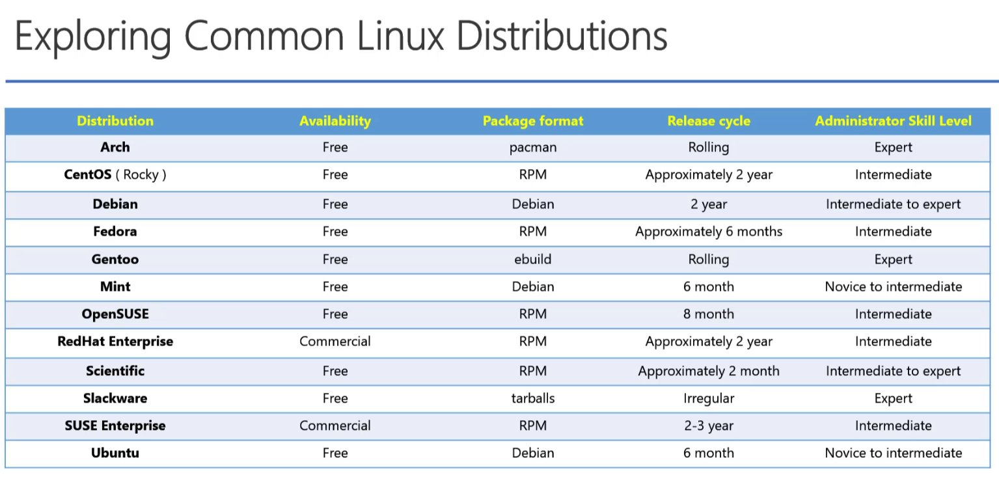
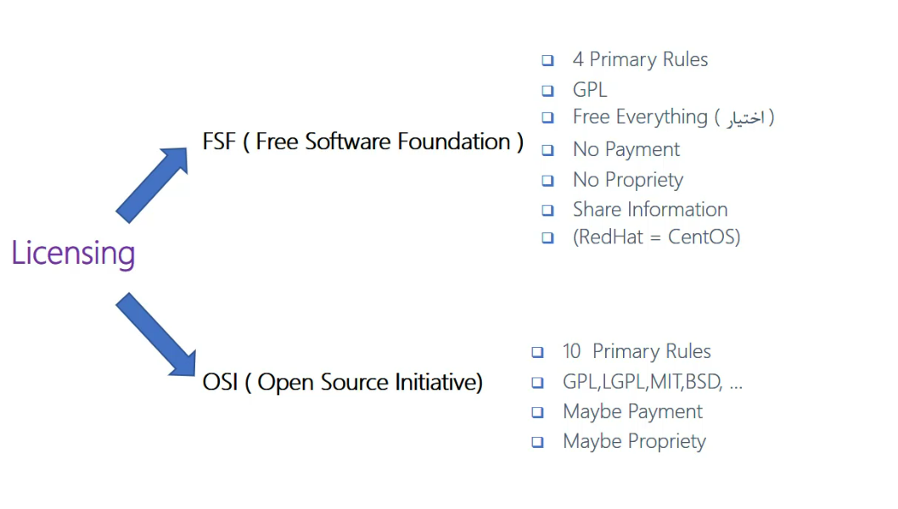

# Learn somethings of OS

## نکات

` linux is kernel and it isn't OS `

`لینوکس یک کرنل است نه سیستم عامل`

`linux mostly uses a library called libc`

`بیشترین لایبرری که در لینوکس استفاده شده اسمش libc هست`

`وقتی گفته میشود چرخه ارایه یک سیستم عامل لینوکسی در حالت rolling هست یعنی آن سیستم عامل فاقد ورژن های مختلف بوده و همان یک نسخه به صورت مداوم و چرخشی آپدیت میشود`

## license

